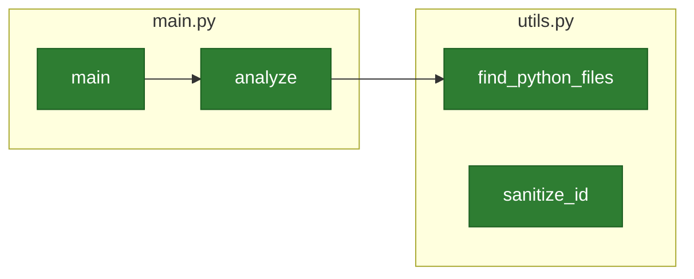

# d4-diag

A powerful Python code analysis tool that generates interactive Mermaid diagrams to visualize your project's structure, dependencies, and architecture.

## 🚀 Overview

d4-diag analyzes Python codebases and generates comprehensive diagrams showing module dependencies, class relationships, and code structure. Perfect for understanding complex projects, documenting architecture, and onboarding new developers.

## ✨ Key Features

- **🔍 Comprehensive Analysis**: Parses Python AST to understand functions, classes, imports, and relationships
- **📁 Smart File Discovery**: Automatically finds all Python files while excluding virtual environments and caches
- **🎨 Multiple Diagram Types**: Generate architecture, class, and module dependency diagrams
- **🖥️ Modern CLI Interface**: Clean, intuitive command-line interface with helpful error messages
- **🌐 Interactive Viewer**: Built-in HTML viewer for exploring diagrams with tabs and navigation
- **⚡ High Performance**: Handles large projects efficiently with size limits and error recovery
- **🛡️ Robust Error Handling**: Gracefully handles syntax errors, encoding issues, and file system problems
- **🔄 Backward Compatible**: Works with legacy command patterns while supporting modern CLI usage

## 📦 Installation

```bash
pip install d4-diag
```

Requires Python 3.8+. Verify the install:

```bash
d4-diag --version
```

## 🎯 Usage

```bash
# Analyze a project directory
d4-diag analyze ./src

# Analyze with verbose output
d4-diag analyze ./src --verbose

# Specify custom output directory
d4-diag analyze ./src --output-dir ./docs/diagrams

# Analyze multiple paths
d4-diag analyze ./src ./tests --verbose

# View generated diagrams
d4-diag viewer ./docs/diagrams

# View without opening browser
d4-diag viewer ./docs/diagrams --no-browser
```

### Run as Python Module

```bash
python -m d4_diag analyze ./src
python -m d4_diag viewer ./docs/diagrams
```

### Get Help

```bash
d4-diag --help
d4-diag analyze --help
d4-diag viewer --help
```

## 📊 Generated Diagrams

d4-diag generates three comprehensive diagrams in your project's `docs/diagrams` directory:

### 1. Architecture Diagram (`architecture.mmd`)
Shows the overall project structure with files, classes, and functions as nodes.

### 2. Class Diagram (`class_diagram.mmd`)
Displays class relationships, inheritance hierarchies, and method definitions.

### 3. Module Dependencies (`module_deps.mmd`)
Illustrates import relationships and module dependencies across your codebase.

## 🖥️ Interactive Viewer

The built-in viewer provides an elegant way to explore your diagrams:

```bash
# Launch interactive viewer
d4-diag viewer ./docs/diagrams

# Features:
# - Tabbed interface for multiple diagrams
# - Responsive design
# - Mermaid.js rendering
# - Easy navigation
```

## 📋 Requirements

- **Python**: 3.8+ (tested on 3.8-3.14)
- **pip**: For installation
- Dependencies are installed automatically with `pip install d4-diag`

## 🎨 Examples

### Basic Project Analysis

```bash
$ d4-diag analyze ./src --verbose
Project root: /path/to/project
Auto-detected project root: /path/to/project
Scanning directory: src
  Found 5 Python files
Analyzing 5 file(s)...
  Processing: src/main.py
  Processing: src/utils.py
  Processing: src/models/user.py
  Processing: src/services/auth.py
  Processing: src/generate_mermaid.py

=== Code Map Summary ===
Files analyzed:   5
Classes found:    3
Functions found:  12
Import links:     4

Generating diagrams in: /path/to/project/docs/diagrams
Done! View diagrams with: d4-diag viewer /path/to/project/docs/diagrams
```

### Sample Generated Diagram



## 🛠️ Advanced Usage

### Custom Project Root

```bash
# For monorepos or complex structures
d4-diag analyze ./packages/myapp --project-root ./packages/myapp
```

### Output Directory Customization

```bash
# Custom output location
d4-diag analyze ./src --output-dir ./documentation/diagrams
```

### Excluding Files and Directories

d4-diag automatically excludes:
- Virtual environments (`.venv`, `venv`, `.env`)
- Cache directories (`__pycache__`, `.pytest_cache`)
- Version control (`.git`, `.hg`)
- Build artifacts (`dist`, `build`, `node_modules`)
- Package directories (`site-packages`, `*.egg-info`)

## 🔍 Troubleshooting

### Common Issues

**"No Python files found!"**
- Ensure you're pointing to a directory with `.py` files
- Check that files aren't in excluded directories

**"Permission denied" errors**
- Check file permissions on your source code
- Ensure virtual environment has read access

**Large project performance**
- d4-diag automatically skips files >10MB
- Use `--verbose` to see processing progress

### Getting Help

```bash
# Get help for commands
d4-diag --help
d4-diag analyze --help
d4-diag viewer --help

# Check version
d4-diag --version
```

## 📈 Performance

- **Memory Efficient**: Processes files incrementally
- **Size Limits**: Automatically skips files >10MB
- **Error Recovery**: Continues analysis after individual file errors
- **Fast Scanning**: Efficient directory traversal with exclusions

## 🤝 Contributing

We welcome contributions! Please see our [Contributing Guide](CONTRIBUTING.md) for details.

## 📄 License

MIT License - see [LICENSE](LICENSE) file for details.

## 🙏 Acknowledgments

- **Mermaid.js**: For excellent diagram rendering
- **Click**: For the beautiful CLI framework
- **pytest**: For the robust testing framework

---

*d4-diag: Understand your codebase at a glance.* 🎯
