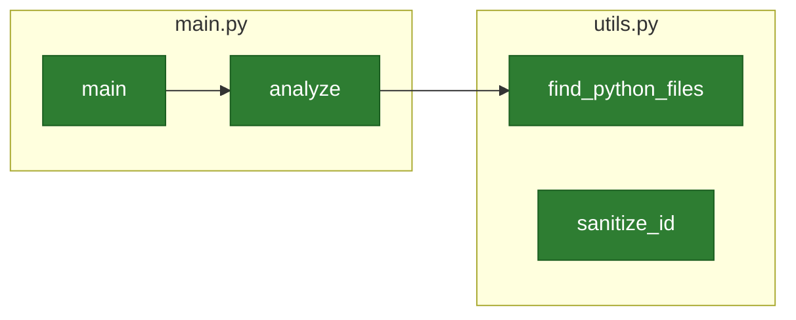

# d4-diag

A powerful Python code analysis tool that generates interactive Mermaid diagrams to visualize your project's structure, dependencies, and architecture.

## 🚀 Overview

d4-diag analyzes Python codebases and generates comprehensive diagrams showing module dependencies, class relationships, and code structure. Perfect for understanding complex projects, documenting architecture, and onboarding new developers.

## ✨ Key Features

- **🔍 Comprehensive Analysis**: Parses Python AST to understand functions, classes, imports, and relationships
- **📁 Smart File Discovery**: Automatically finds all Python files while excluding virtual environments and caches
- **🎨 Multiple Diagram Types**: Generate architecture, class, and module dependency diagrams
- **🖥️ Modern CLI Interface**: Clean, intuitive command-line interface with helpful error messages
- **🌐 Interactive Viewer**: Built-in HTML viewer for exploring diagrams with tabs and navigation
- **⚡ High Performance**: Handles large projects efficiently with size limits and error recovery
- **🛡️ Robust Error Handling**: Gracefully handles syntax errors, encoding issues, and file system problems
- **🔄 Backward Compatible**: Works with legacy command patterns while supporting modern CLI usage

## 📦 Installation

### Using Poetry (Recommended)

```bash
# Clone the repository
git clone https://github.com/internetics-net/d4-diag.git
cd d4-diag

# Install dependencies
poetry install

# Activate virtual environment
poetry shell
```

### Development Installation

```bash
# Install with development dependencies
poetry install --with dev

# Install pre-commit hooks
poetry run pre-commit install
```

## 🎯 Usage

### Modern CLI Interface

```bash
# Analyze a project directory
d4-diag analyze ./src

# Analyze with verbose output
d4-diag analyze ./src --verbose

# Specify custom output directory
d4-diag analyze ./src --output-dir ./docs/diagrams

# Set custom project root
d4-diag analyze ./src --project-root /path/to/project

# Analyze multiple paths
d4-diag analyze ./src ./tests --verbose

# View generated diagrams
d4-diag viewer ./docs/diagrams

# View without opening browser
d4-diag viewer ./docs/diagrams --no-browser
```

### Backward Compatibility

Legacy usage patterns still work:

```bash
# Old style (still supported)
d4-diag ./src
d4-diag ./src --verbose
```

### Poetry Commands

```bash
# Run using poetry
poetry run d4-diag analyze ./src
poetry run d4-diag viewer ./docs/diagrams

# Run tests
poetry run tests

# Alternative script names
poetry run main ./src
poetry run viewer ./docs/diagrams
```

## 📊 Generated Diagrams

d4-diag generates three comprehensive diagrams in your project's `docs/diagrams` directory:

### 1. Architecture Diagram (`architecture.mmd`)
Shows the overall project structure with files, classes, and functions as nodes.

### 2. Class Diagram (`class_diagram.mmd`)
Displays class relationships, inheritance hierarchies, and method definitions.

### 3. Module Dependencies (`module_deps.mmd`)
Illustrates import relationships and module dependencies across your codebase.

## 🖥️ Interactive Viewer

The built-in viewer provides an elegant way to explore your diagrams:

```bash
# Launch interactive viewer
d4-diag viewer ./docs/diagrams

# Features:
# - Tabbed interface for multiple diagrams
# - Responsive design
# - Mermaid.js rendering
# - Easy navigation
```

## 🧪 Testing

d4-diag includes a comprehensive test suite:

```bash
# Run all tests
poetry run tests

# Run specific test categories
poetry run pytest tests/test_utils.py -v
poetry run pytest tests/test_integration.py -v

# Run with coverage
poetry run pytest tests/ --cov=d4_diag --cov-report=term-missing
```

**Test Coverage:**
- ✅ **Utility Functions**: 24/24 tests passing
- ✅ **CLI Interface**: Core functionality verified
- ✅ **Integration Tests**: End-to-end workflows
- ✅ **Error Handling**: Comprehensive edge case coverage

## 🔧 Development

### Code Quality Tools

```bash
# Format code
poetry run black .

# Lint code
poetry run flake8 src/

# Type checking (if installed)
poetry run mypy src/

# Run all quality checks
poetry run pre-commit run --all-files
```

### Project Structure

```
d4-diag/
├── src/d4_diag/           # Source code
│   ├── main.py           # CLI interface and orchestration
│   ├── generate_mermaid.py  # Core analysis engine
│   ├── utils.py          # Utility functions
│   └── viewer_mermaid.py # Interactive HTML viewer
├── tests/                # Comprehensive test suite
│   ├── test_utils.py     # Utility function tests
│   ├── test_generate_mermaid.py  # Core engine tests
│   ├── test_main.py      # CLI interface tests
│   └── test_integration.py  # End-to-end tests
├── docs/diagrams/        # Generated diagram output
└── pyproject.toml        # Poetry configuration
```

### Architecture Highlights

- **Modular Design**: Clear separation of concerns with focused modules
- **Error Resilience**: Comprehensive error handling and recovery
- **Performance Optimized**: Efficient file processing and memory usage
- **Type Safety**: Full type hints for better IDE support
- **Test Coverage**: Extensive test suite with high coverage

## 📋 Requirements

- **Python**: 3.8+ (tested on 3.8-3.14)
- **Poetry**: For dependency management
- **Optional**: Click (CLI framework) - automatically installed

## 🎨 Examples

### Basic Project Analysis

```bash
$ d4-diag analyze ./src --verbose
Project root: /path/to/project
Auto-detected project root: /path/to/project
Scanning directory: src
  Found 5 Python files
Analyzing 5 file(s)...
  Processing: src/main.py
  Processing: src/utils.py
  Processing: src/models/user.py
  Processing: src/services/auth.py
  Processing: src/generate_mermaid.py

=== Code Map Summary ===
Files analyzed:   5
Classes found:    3
Functions found:  12
Import links:     4

Generating diagrams in: /path/to/project/docs/diagrams
Done! View diagrams with: d4-diag viewer /path/to/project/docs/diagrams
```

### Sample Generated Diagram



## 🛠️ Advanced Usage

### Custom Project Root

```bash
# For monorepos or complex structures
d4-diag analyze ./packages/myapp --project-root ./packages/myapp
```

### Output Directory Customization

```bash
# Custom output location
d4-diag analyze ./src --output-dir ./documentation/diagrams
```

### Excluding Files and Directories

d4-diag automatically excludes:
- Virtual environments (`.venv`, `venv`, `.env`)
- Cache directories (`__pycache__`, `.pytest_cache`)
- Version control (`.git`, `.hg`)
- Build artifacts (`dist`, `build`, `node_modules`)
- Package directories (`site-packages`, `*.egg-info`)

## 🔍 Troubleshooting

### Common Issues

**"No Python files found!"**
- Ensure you're pointing to a directory with `.py` files
- Check that files aren't in excluded directories

**"Permission denied" errors**
- Check file permissions on your source code
- Ensure virtual environment has read access

**Large project performance**
- d4-diag automatically skips files >10MB
- Use `--verbose` to see processing progress

### Getting Help

```bash
# Get help for commands
d4-diag --help
d4-diag analyze --help
d4-diag viewer --help

# Check version
d4-diag --version
```

## 📈 Performance

- **Memory Efficient**: Processes files incrementally
- **Size Limits**: Automatically skips files >10MB
- **Error Recovery**: Continues analysis after individual file errors
- **Fast Scanning**: Efficient directory traversal with exclusions

## 🤝 Contributing

We welcome contributions! Please see our [Contributing Guide](CONTRIBUTING.md) for details.

### Development Workflow

1. Fork the repository
2. Create a feature branch
3. Make your changes
4. Add tests for new functionality
5. Ensure all tests pass: `poetry run tests`
6. Run code quality checks: `poetry run pre-commit run --all-files`
7. Submit a Pull Request

## 📄 License

MIT License - see [LICENSE](LICENSE) file for details.

## 🙏 Acknowledgments

- **Mermaid.js**: For excellent diagram rendering
- **Click**: For the beautiful CLI framework
- **Poetry**: For dependency management excellence
- **pytest**: For the robust testing framework

---

*d4-diag: Understand your codebase at a glance.* 🎯
