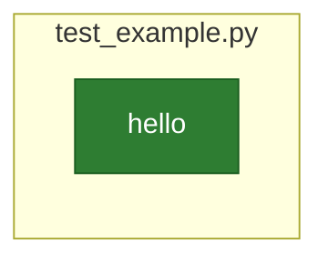

# Architecture Diagram

```mermaid
graph LR
    classDef fileStyle fill:#37474F,stroke:#263238,color:#ECEFF1,font-weight:bold;
    classDef classNodeStyle fill:#1565C0,stroke:#0D47A1,color:white;
    classDef funcStyle fill:#2E7D32,stroke:#1B5E20,color:white;

    subgraph id_test_example_py["test_example.py"]
        direction TB
        id_test_example_py_hello["hello"]:::funcStyle
    end
```

This diagram shows the overall architecture of the D4-Diag tool, including the main components and their interactions.
