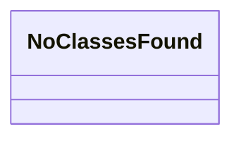

# Class Diagram

Sample class diagram. Regenerate with `d4-diag analyze src/ --output-dir docs/diagrams`.

This diagram illustrates the class structure and relationships within the D4-Diag codebase.
