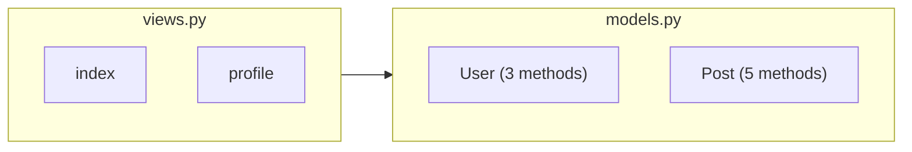

# Examples

Real-world usage examples for D4-Diag.

## Example 1: Analyzing a Flask Application

```bash
# Clone a sample Flask app
git clone https://github.com/example/flask-app.git
cd flask-app

# Analyze the application
poetry run main app/

# View diagrams
poetry run viewer app/docs/diagrams
```

**What you'll see:**
- Architecture showing routes, models, and utilities
- Class diagram with SQLAlchemy models
- Module dependencies showing app structure

## Example 2: Understanding a Django Project

```bash
# Navigate to Django project
cd my-django-project

# Analyze specific apps
poetry run main myapp/ accounts/ api/

# View diagrams
poetry run viewer docs/diagrams
```

**Insights:**
- See which apps import from which
- Understand model inheritance
- Identify circular dependencies

## Example 3: Documenting a Library

```bash
# Analyze your library
cd my-library
poetry run main src/

# Commit diagrams to repo
git add docs/diagrams/*.mmd
git commit -m "Add architecture diagrams"
```

**Benefits:**
- Auto-generated documentation
- Visual API overview
- Easier onboarding

## Example 4: Code Review

Before reviewing a pull request:

```bash
# Checkout PR branch
git checkout pr-123

# Analyze changed modules
poetry run main src/models/ src/services/

# Compare with main branch
git checkout main
poetry run main src/models/ src/services/

# View both sets of diagrams
```

**Use cases:**
- Verify architectural changes
- Spot unintended dependencies
- Review class design

## Example 5: Refactoring Planning

```bash
# Analyze current state
poetry run main src/
cp -r docs/diagrams docs/diagrams-before

# After refactoring
poetry run main src/
cp -r docs/diagrams docs/diagrams-after

# Compare
diff docs/diagrams-before/ docs/diagrams-after/
```

**Helps with:**
- Visualizing impact of changes
- Ensuring dependencies are simplified
- Documenting refactoring decisions

## Example 6: Microservices Architecture

```bash
# Analyze each service
for service in service-a service-b service-c; do
    poetry run main $service/
    mv $service/docs/diagrams docs/$service-diagrams
done

# View all services
poetry run viewer docs/service-a-diagrams
poetry run viewer docs/service-b-diagrams
poetry run viewer docs/service-c-diagrams
```

**Insights:**
- Compare service complexity
- Identify shared patterns
- Plan service boundaries

## Example 7: Test Coverage Visualization

```bash
# Analyze source code
poetry run main src/
mv docs/diagrams docs/src-diagrams

# Analyze tests
poetry run main tests/
mv docs/diagrams docs/test-diagrams

# Compare to see what's tested
```

**Reveals:**
- Which classes have test coverage
- Test organization
- Missing test files

## Example 8: Programmatic Usage

```python
#!/usr/bin/env python3
"""Generate diagrams for multiple projects"""

from pathlib import Path
from d4_diag.main import CodeMapAnalyzer, find_python_files

projects = [
    "/path/to/project-a",
    "/path/to/project-b",
    "/path/to/project-c"
]

for project_root in projects:
    print(f"\nAnalyzing {project_root}...")

    # Find files
    files = find_python_files(project_root)

    # Analyze
    analyzer = CodeMapAnalyzer(project_root)
    analyzer.build_module_map(files)

    for f in files:
        analyzer.analyze_file(f)

    # Generate
    output = Path(project_root) / "docs" / "diagrams"
    analyzer.generate_all(str(output))

    print(f"  Generated diagrams in {output}")
```

## Example 9: CI/CD Integration

Add to `.github/workflows/diagrams.yml`:

```yaml
name: Generate Diagrams

on:
  push:
    branches: [main]

jobs:
  diagrams:
    runs-on: ubuntu-latest
    steps:
      - uses: actions/checkout@v3

      - name: Setup Python
        uses: actions/setup-python@v4
        with:
          python-version: '3.10'

      - name: Install Poetry
        run: curl -sSL https://install.python-poetry.org | python3 -

      - name: Install D4-Diag
        run: |
          git clone https://github.com/internetics-net/d4-diag.git
          cd d4-diag
          poetry install

      - name: Generate Diagrams
        run: |
          cd d4-diag
          poetry run main ../src

      - name: Commit Diagrams
        run: |
          git config user.name "GitHub Actions"
          git config user.email "actions@github.com"
          git add docs/diagrams/*.mmd
          git diff --quiet && git diff --staged --quiet || git commit -m "Update diagrams"
          git push
```

## Example 10: Embedding in README

After generating diagrams, embed them in your README:

````markdown
# My Project

## Architecture



See [full diagrams](docs/diagrams/) for details.
````

## Next Steps

- [User Guide](user-guide/analyzing-code.md) - Detailed usage
- [CLI Reference](reference/cli.md) - All commands
- [Contributing](contributing.md) - Add your own examples
