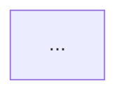

# Examples

Real-world usage patterns for **d4-diag**.

## Analyze a Flask or Django app

```bash
cd my-web-app
d4-diag analyze app/
d4-diag viewer docs/diagrams
```

For Django, point at app packages:

```bash
d4-diag analyze myapp/ accounts/ api/
```

## Document a library

```bash
cd my-library
d4-diag analyze src/
git add docs/diagrams/*.mmd
git commit -m "Add architecture diagrams"
```

Embed Mermaid in README or publish via MkDocs.

## Monorepo / custom root

```bash
d4-diag analyze ./packages/core/src --project-root ./packages/core
d4-diag viewer ./packages/core/docs/diagrams
```

## Compare before/after refactor

```bash
d4-diag analyze src/
cp -r docs/diagrams docs/diagrams-before

# … refactor …

d4-diag analyze src/
diff -ru docs/diagrams-before docs/diagrams
```

## Multiple services

```bash
for svc in service-a service-b; do
  d4-diag analyze "$svc/src" --output-dir "docs/diagrams/$svc"
done
d4-diag viewer docs/diagrams/service-a
```

## Programmatic batch

```python
from d4_diag import CodeMapAnalyzer, find_python_files
from pathlib import Path

for project in ["/path/a", "/path/b"]:
    files = find_python_files(project)
    analyzer = CodeMapAnalyzer(project)
    analyzer.build_module_map(files)
    for f in files:
        analyzer.analyze_file(f)
    out = Path(project) / "docs" / "diagrams"
    analyzer.generate_all(save_files=True, output_dir=str(out))
    print(f"{project} → {out}")
```

## GitHub Actions (sketch)

```yaml
name: Diagrams

on:
  push:
    branches: [main]

jobs:
  diagrams:
    runs-on: ubuntu-latest
    steps:
      - uses: actions/checkout@v4
      - uses: actions/setup-python@v5
        with:
          python-version: "3.11"
      - run: pip install d4-diag
      - run: d4-diag analyze src/ --output-dir docs/diagrams
      - run: d4-diag viewer docs/diagrams --no-browser
      - uses: stefanzweifel/git-auto-commit-action@v5
        with:
          commit_message: Update architecture diagrams
          file_pattern: docs/diagrams/*.mmd
```

## Dev checkout (this repo)

```bash
poetry install
poetry run d4-diag analyze src/
poetry run d4-diag viewer docs/diagrams
poetry run pytest tests -v
```

## Embed in Markdown

After generating `architecture.mmd`, copy the Mermaid block into README:

````markdown
## Architecture


```mermaid
graph LR
  ...
```
````

GitHub renders Mermaid natively in Markdown files.

## Next steps

- [Quick Start](getting-started/quick-start.md)
- [Programmatic Usage](user-guide/programmatic-usage.md)
- [Contributing](contributing.md)
