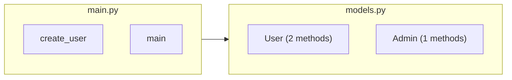
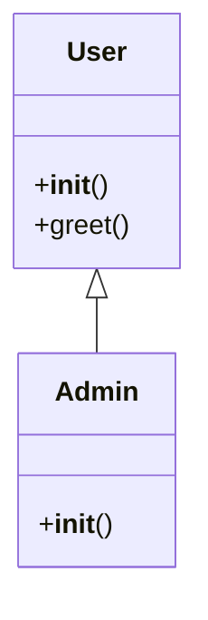
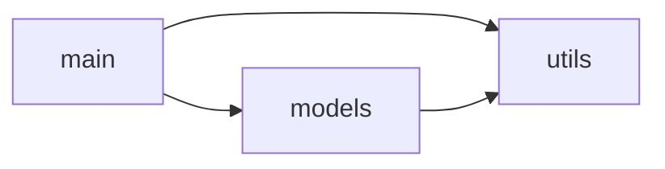

# Diagram Types

D4-Diag generates three complementary diagrams to help you understand your codebase.

## Architecture Overview

**File**: `architecture.mmd`

Shows your project's file structure with each file as a subgraph containing its classes and functions.

### What It Shows

- **Files as containers** - Each Python file is a labeled box
- **Classes** - Shown with method count (e.g., "User (3 methods)")
- **Functions** - Top-level functions in each file
- **Import relationships** - Arrows between files that import each other

### When to Use

- Understanding project structure
- Seeing which files contain which components
- Identifying cross-file dependencies
- Onboarding new developers

### Example

## Class Diagram

**File**: `class_diagram.mmd`

A UML-style class diagram showing all classes with their methods and inheritance.

### What It Shows

- **Classes** - All class definitions
- **Methods** - All methods in each class (prefixed with `+`)
- **Inheritance** - Arrows from base class to derived class

### When to Use

- Understanding class hierarchies
- Seeing all methods at a glance
- Identifying inheritance patterns
- Designing new classes

### Example

### Limitations

- Only shows classes (not standalone functions)
- Shows method names but not signatures
- Doesn't show attributes/properties
- External base classes may not show inheritance

## Module Dependencies

**File**: `module_deps.mmd`

A clean dependency graph showing which modules import from which.

### What It Shows

- **Modules** - Each Python file as a node
- **Import relationships** - Arrows from importer to imported
- **Only project files** - External imports (e.g., `numpy`) are excluded

### When to Use

- Understanding module coupling
- Identifying circular dependencies
- Planning refactoring
- Seeing high-level architecture

### Example

### Import Resolution

D4-Diag resolves imports by:
1. Building a module map: `src/models.py` → `models`
2. Matching import statements to project files
3. Creating edges for local imports only

Both `import models` and `from models import User` create the same edge.

## Choosing the Right Diagram

| Goal | Use This Diagram |
|------|------------------|
| See project structure | Architecture |
| Understand class hierarchy | Class Diagram |
| Find circular dependencies | Module Dependencies |
| Onboard new developer | Architecture → Module Deps |
| Plan refactoring | Module Dependencies |
| Design new feature | Class Diagram → Architecture |

## Diagram Sizes

For a typical project:

- **Architecture**: Largest (shows everything)
- **Class Diagram**: Medium (classes only)
- **Module Dependencies**: Smallest (files only)

## Mermaid Syntax

All diagrams use Mermaid syntax and can be:
- Viewed in the D4-Diag viewer
- Embedded in GitHub README
- Rendered in VS Code with Mermaid extension
- Converted to images with Mermaid CLI

## Next Steps

- [Viewing Diagrams](viewing-diagrams.md) - Interactive viewer features
- [Examples](../examples.md) - Real-world diagram examples
